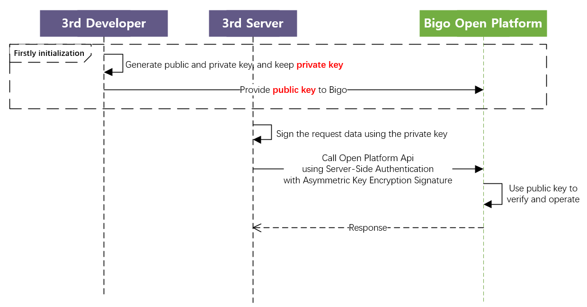

# BIGOLIVE Open Platform Access Guide

# 1. Bigolive Oauth2.0 Authorization Procedure

Bigolive OAuth2.0 Authorization Login allows Bigolive users to securely login to third-party applications or websites using their Bigolive credentials. After the user authorizes the third-party access through OAuth, the third-party application can obtain the user's access_token and use it to access the Bigolive user's basic information. Bigolive OAuth2.0 Authorization Login currently supports the authorization_code mode and is suitable for server-side application authorization. The overall process of this mode is as follows:

1. When a third-party initiates an OAuth login authorization request, the OAuth authorization page will be redirected to the third-party website after the user allows the third-party application to access their information, carrying a temporary authorization code parameter. 
2. By using the code parameter along with AppID and AppSecret, access_token can be obtained through the API. 
3. By using access_token, platform interface can be requested to obtain user basic data resources or to assist users in achieving basic operations.

The sequence diagram of access_token as follows：


# 2. Authorization Process Integration Steps

## 2.1. Preparatory Steps

### 2.1.1. Domain Address

Interface domain and API should be filled in as {{host_domain}} and replaced according to different environments.

Production environment: [oauth.bigolive.tv](http://oauth.bigolive.tv) , backup domain: [oauth.bigoapp.tv](http://oauth.bigoapp.tv)

### 2.1.2. Business Key Allocation

Bigo will allocate AppID and AppSecret for third-party applications, and third-party applications will provide the icon URL of the authorization page. If necessary, please contact the live broadcast platform liaison urgently to obtain it.

### 2.1.3. Required information from the business side

Please provide relevant information in advance, which includes redirection authorization and display of authorization page information, including:

| **Field**    | **Description**                                              |
| ------------ | ------------------------------------------------------------ |
| app_icon     | Display the third-party app icon on the authorization  page, and it is recommended that the size should be larger than 50*50 to  ensure clarity |
| app_name     | Display the third-party app name on the authorization  page  |
| redirect_uri | After successful verification of login on Bigo Live,  redirect to the receiving address for code sending, which supports multiple  redirect_uri whitelists |

### 2.1.4. Generate private and public key

The third parties should generate the private and public key, keep the private key safely yourself, and provide the public key and algorithm(RS256 or ES256) to Bigo. 

Detail See [PART 3.1.1.](#311-step-1-generate-private-and-public-key)

You can pre-check the format of public key if is correct through [this website](https://merri.cx/enigmator/cryptanalysis/rsa_key_analysis.html).

### 2.1.5. Error code

It is specially agreed that when the HTTP gateway status code returns 200, normal business data processing is carried out, and the interface returns a JSON body. The specific business error code will be returned in the JSON body. If the status code is not 200, abnormal diagnosis should be carried out based on different status codes.

Gateway Error Codes as follows:

| **Gateway code** | **Description**                                              |
| ---------------- | ------------------------------------------------------------ |
| 200              | Normal, specific business processing can be carried out      |
| 405              | Request method does not exist                                |
| 401              | The token is invalid or has expired, it is used for  interfaces that require access token request |
| 408              | Gateway rate limit                                           |
| 500              | Request parameter exception                                  |


## 2.2. Step 1: Obtain code through authorization page


### 2.2.1. Access method 1: App redirection authorization login access

Purpose: Generally applicable to users who have installed the Bigolive App. If this method is applied and the user does not have the Bigolive App installed, they need to be guided to download it from the app store. It is recommended to use this method for access. If this access method is applied, they may ignore 2.2.2.

Note: This access method cannot be verified in the testing environment (the testing environment of the Bigolive App cannot be used externally).

Third-party app integration of Bigolive OAuth2.0 Deeplink

```python
bigolive://oauth?lang=en&state=12345&scope=openid&redirect_uri=http%3A%2F%2Ftest-login.uho.fun%2Fd%2Fbigo.php%3FIEMI%3D8651f0e36795d692de18a50d16e80634&response_type=code&client_id=1WlQhfrwcb2Gmqa
```


### 2.2.2. Access method 2: Web page integration

Purpose: Generally used for website applications. If this access method is applied, they may ignore 2.1.1

For example, Bark app with Bigolive Oauth2.0 website:


Third-party app integration page for Bigolive OAuth2.0

```
https://www.bigo.tv/oauth2/pc.html?lang=en&state=12345&scope=user_im+openid&redirect_uri=https%3A%2F%2Fwww.bark.us%2Fauth%2Fbigo_live%2Fcallback&response_type=code&client_id=1f744717e37e0ac
```


### 2.2.3 Parameters

| **Parameters** | **Type** | **Required** | **Description**                                              |
| -------------- | -------- | ------------ | ------------------------------------------------------------ |
| lang           | string   | No           | Page language, refers to the list of country codes           |
| state          | string   | No           | This parameter is used to maintain the state of the  request and callback, and is returned to the third party in its original form  after authorization. This parameter can be used to prevent CSRF attacks (cross-site  request forgery attacks). It is recommended that the third party include this  parameter, which can be set to a simple random number plus session for  verification. During the transmission of the state, this parameter will be  processed as part of the URL. Therefore, it is recommended to perform URL  encoding on this parameter to prevent special characters (such as '#' and  '&') that affect URL parsing from causing the parameter to be incorrectly  returned. |
| scope          | string   | Yes          | The scope of application authorization can have  multiple scopes separated by symbols (+); for obtaining openid, add 'openid' |
| redirect_uri   | string   | Yes          | 1.uri requires authorization from the Bigo Live, must  be as same as 2.0.3 provided  2. Use urlEncode to process the link; |
| response_type  | string   | Yes          | Required as ‘Code’                                           |
| client_id      | string   | Yes          | Business unique identifier assigned by Bigolive              |

Response description:

After the user grants permission, they will be redirected to the website specified in the redirect_uri parameter, with the code and state parameters included. Example: redirect_uri?code=CODE&state=STATE 

If the user denies permission, no redirection will occur

**<font color='#dd00000'>Note: The code is valid for 60 seconds and can only be used once.</font>**


## 2.3. Step 2: Obtain access_token through code

**API:**

```python
POST  https://{{host_domain}}/sign/oauth2/token
Content-type: application/json
bigo-client-id: {{client_id}}
bigo-oauth-signature: {{calculate the sign}} 
bigo-timestamp: {{timestamp}}

{
    "code":"{{code}}",
    "grant_type":"authorization_code",
    "redirect_uri":"{{redirect_uri}}"
}
```

The access_token is used as a credential for third-party applications to access user data on the Bigo Live platform. It is important to obtain the accesstoken through backend and then return it to the client to prevent security information leakage. The validity period is usually set to 2 hours.

**Request headers description:**

Detail See [PART 3.1.2. & PART 3.1.3.](#312-step-2-sign-the-request-data-with-private-key)

**Request parameter description:**

| **Parameters** | **Type** | **Required** | **Description**                                              |
| -------------- | -------- | ------------ | ------------------------------------------------------------ |
| code           | string   | Yes          | The temporary ticket returned by the authorized login,  refer to 2.1 |
| grant_type     | string   | Yes          | Required authorization_code                                  |
| redirect_uri   | string   | Yes          | 1. To maintain consistency with obtaining the code in  2.1  1.    Use urlEncode to process the link  2.    It needs to be placed at the end |

**Response description:**

| **Parameters** | **Type**     | **Description**                                              |
| -------------- | ------------ | ------------------------------------------------------------ |
| access_token   | string       | The interface calling credential, valid for 2 hours;         |
| token_type     | string       | Authorization type, can be ignored, must return  "bearer"    |
| expires_in     | unsigned int | Expiration time (currently set to 10 days, validity  period is subject to the returned parameter) |
| refresh_token  | string       | The token for refreshing the access_token by the user  has a validity period longer than that of the access_token and is set to one  month. For specific usage, please refer to section 2.3 |
| scope          | string       | Application authorization scope                              |
| openid         | string       | Unique identifier for authorized users                       |
| message        | string       | Specific error message, please refer to the error  message instruction below. |
| rescode        | unsigned int | Error code                                                   |
|                |              |                                                              |

Error message description:

| **message**         | **Description**                                              |
| ------------------- | ------------------------------------------------------------ |
| invalid_request     | The request is missing a parameter so the server can’t proceed with the  request. This may also be returned if the request includes an unsupported  parameter or repeats a parameter. |
| invalid_client      | Client authentication failed, such as if the request  contains an invalid client ID or secret. |
| invalid_grant       | The authorization code is invalid or expired. This is  also the error you would return if the redirect URL given in the  authorization grant does not match the URL provided in this access token  request. |
| invalid_scope       | For access token requests that include a scope (openid  or read), this error indicates an invalid scope value in the request. |
| unauthorized_client | This client is not authorized to use the requested  grant type. For example, if you restrict which applications can use the  Implicit grant, you would return this error for the other apps. |

Response Example：

```python
HTTP/1.1 200 OK
Content-Type: application/json

{
"access_token":"MTQ0NjJkZmQ5OTM2NDE1ZTZjNGZmZjI3",
"token_type":"bearer",
"expires_in":3600,
"refresh_token":"IwOGYzYTlmM2YxOTQ5MGE3YmNmMDFkNTVk",
"scope":"openid read",
"openid":"9adjfajll11adfa",
"message":"",
"rescode":200
}
```

**<font color='#dd00000'>Note: Only the latest refresh_token and access_token are valid.</font>**


## 2.4. Step 3: Refreshing the validity period of access_token

**API:**

```python
POST https://{{host_domain}}/sign/oauth2/refresh_token
Content-type: application/json
bigo-client-id: {{client_id}}
bigo-oauth-signature: {{calculate the sign}} 
bigo-timestamp: {{timestamp}}

{
    "grant_type":"refresh_token",
    "refresh_token":"{{refresh_token}}"
}

```

It is necessary to refresh the accesstoken through the backend before returning it to the client end to prevent the leakage of security information

**Request headers description:**

Detail See [PART 3.1.2. & PART 3.1.3.](#312-step-2-sign-the-request-data-with-private-key)

**Request parameter description:**

| **Parameters** | **Type** | **Required** | **Description**                                 |
| -------------- | -------- | ------------ | ----------------------------------------------- |
| refresh_token  | string   | Yes          | refresh_token returned from 2.2                 |
| grant_type     | string   | Yes          | Authorization type, refresh_token is required   |

**Response description:**

| **Parameters** | **Type**     | **Description**                                              |
| -------------- | ------------ | ------------------------------------------------------------ |
| access_token   | string       | Interface calling credential                                 |
| token_type     | string       | Authorization type, can be ignored, must return  "bearer"    |
| expires_in     | unsigned int | Expiration time (currently set to 10 days, validity  period is subject to the returned parameter) |
| refresh_token  | string       | The token for refreshing the access_token by the user        |
| scope          | string       | Application authorization scope                              |
| message        | string       | Specific  error message, please refer to 2.2 error message explanation |
| rescode        | unsigned int | 200:  success, 400:  invalid error, (Request  parameters are abnormal or clientid does not exist, refresh_token does not  exist.)500:  server error |
|                |              |                                                              |

#     

# 3. Server-side Signature Authentication

Signature authentication method is mainly used for identity authentication of interactions between the Bigo platform and third-party service servers. If you only use Server-side signature authentication, you can ignore step 1 to step 3 in "II. Authorization Process Integration Steps".

## 3.1. Asymmetric Key Encryption Signature Algorithm

This signature generation method is suitable for business data-sensitive interfaces, such as payment and other APIs. Third parties can ensure the security of signatures by themselves. The public and private keys are generated by the business, and the private key is retained by the business and used to generate signatures, the public key is provided to Bigo and used to verify the signature.

The specific process is as follows:



Bigo only support <font color='#dd00000'>**RS256**</font>(RSA-SHA256) and <font color='#dd00000'>**ES256**</font> (ECDSA-SHA256)

**References:** 

            A.     RS256, PKCS#1 v1.5 (RSA):

https://pycryptodome.readthedocs.io/en/latest/src/signature/pkcs1_v1_5.html

            B.     ES256, DSA and ECDSA:

https://pycryptodome.readthedocs.io/en/latest/src/signature/dsa.html


### 3.1.1. Step 1: Generate private and public key

Firstly and once, the third parties should generate the private and public key, keep the private key safely yourself, and provide the public key and algorithm(RS256 or ES256) to Bigo. Here is a python demo for key generation with RS256, and you can get them in other way. Remind, Only support <font color='#dd00000'>**RS256 and ES256**</font>

See key-generation demo: [key-generation demo](./demo/generate_key.py)


### 3.1.2. Step 2: Sign the request data with private key

Here is rs256 and es256 python signature demos:  ([ES256 demo](./demo/es256_sign_req.py) , [RS256 demo](./demo/rs256_sign_req.py))


### 3.1.3. Step 3: Call Api with Signature

Request parameter description:

The signature is placed in the header of the http request. The specific example format is as follows: 

```python
POST https://{{host_domain}}/broom/xxx_svr_api
Content-type: application/json
bigo-client-id: {client_id}
bigo-timestamp: {timestamp}
bigo-client-version: {version}
bigo-oauth-signature: {sign}
{{postdata}}
```

**Header description：**

| **Header**           | **Description**                                              |
| -------------------- | ------------------------------------------------------------ |
| Content-type         | only support 'application/json‘                              |
| bigo-client-id       | Business unique identifier assigned by Bigolive              |
| bigo-oauth-signature | Authorization signature with Step 2                          |
| bigo-timestamp       | Second level timestamp                                       |
| bigo-client-version  | version of the asymmetric key. Optional, needn't to fill it. Only when you want to update the private and public keys, you can fill it with 1,2,3 or others. |

# 4. Open Platform API

## 4.0. Demo Test API

demo is using Server-side Signature Authentication.

for example, demo is assigned client_id=UP52el4VDWDqgw4 and client_secret=UPdsDSD52el4VSDSDWRDSssDWss//sasDqgw4（**developer should replace the id and secret, both of demo are not work**)

developer should test this api firstly to ensure the generation of bigo-oauth-signature is work.


**Request HTTP Syntax**

```
POST https://{{host_domain}}/oauth2/test_sign HTTP/1.1
Content-type: application/json
bigo-client-id: UP52el4VDWDqgw4
bigo-openid: 4p4sCJHRPGeTcqNp8YWgP1VutodfzkEoWF  // optional
bigo-oauth-signature: {{bigo-oauth-signature}}
bigo-timestamp: {{timestamp}}
bigo-client-version: {{version}}  // optional, default 0

{
  "msg":"hello"
}
```


**Param Assignment:**

host_domain = oauth.bigolive.tv

timestamp= 1688701573

msg_before_sign = "{\n \\"msg\\":\\"hello\\"\n}/oauth2/test_sign1688701573"

msg_hash = sha256(msg_before_sign)

bigo-oauth-signature = base64encode(rsa.sign(msg_hash))


**Response HTTP Syntax**

```python
HTTP/1.1 200

{
    "msg":"hello"
}
```


## 4.1. Obtaining Basic User Information

Description: API for obtaining some basic non-sensitive user data, should using access_token to authenticate.

**API：**

```
POST https://{{host_domain}}/oauth2/userV2
Authorization: Bearer {{access_token}}

{}
```


**4.1.1. Header description:**

A.     Authorization：

i. Please do not modify the **Bearer**, it is a fixed authentication method of Bigo

ii. access_token: token The user authorization token obtained after logging in with authorization.

Note: For the multi-room gameplay, it is recommended to use the room owner's accesstoken for authentication.


**4.1.2. Request parameter description:** 

No input parameters required


**1.3 Response parameter description:**

| **Parameter** | **Type** | **Description**                                              |
| ------------- | -------- | ------------------------------------------------------------ |
| openid        | string   | openid of the user                                           |
| nick_name     | string   | username, it is recommended to use this as the display  name on the list |
| bigo_id       | string   | bigoid of the user                                           |
| avatars       | json     | User avatar {"medium":"https://static-web.bigolive.tv/as/bigo-static/68539/96x96.png?resize=21&dw=195","small":"","big":""} |
| res_code      | int      | 200: success, 400: invalid error, 500: server error          |
|               |          |                                                              |

 Example:

```
{
    "openid":"AREs3WAE9dkxPHD2boypQFU9CJo8CITFhPhr91",
    "nick_name":"ID:861163128",
    "bigo_id":"861163128",
    "res_code":200,
    "avatars":{"medium":"","samll":"","big":""}
}
```


## 4.2. Reseller API

See: [Reseller API](./reseller_api.md)

## 4.3. Damu Data API

See: [Danmu Data API](./danmu_data_api_cn.md)
