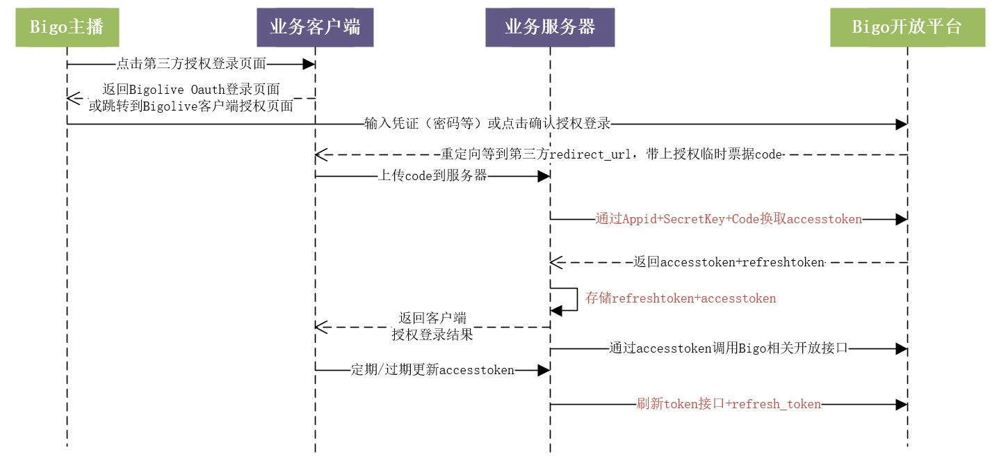
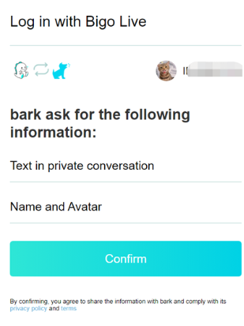
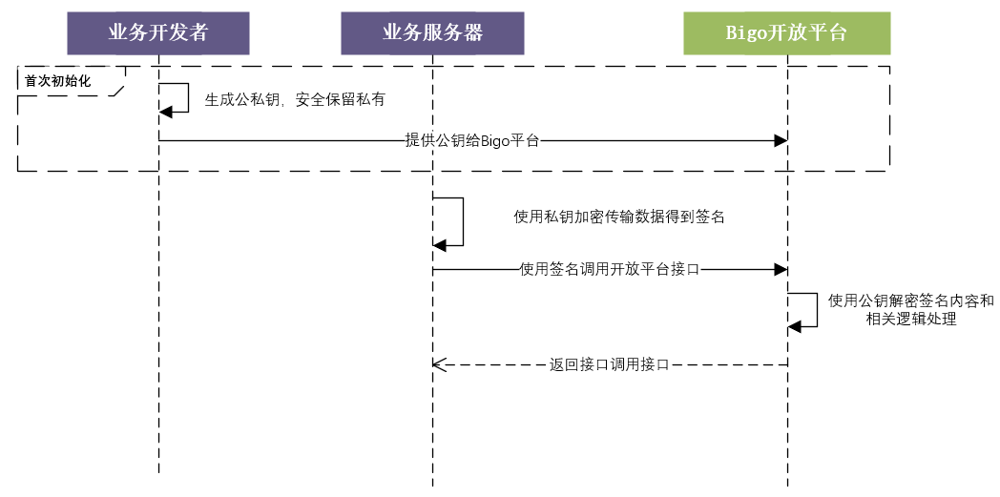

# BIGOLIVE开放平台接入说明

# 一、授权流程说明

Bigolive OAuth2.0授权登录让Bigolive用户使用Bigolive身份安全登录第三方应用或网站，在用户通过Oauth授权登录第三方应用后，第三方可以获取到用户的接口调用凭证（access_token），通过access_token可以获取Bigolive用户基本的开放信息等。Bigolive OAuth2.0授权登录目前支持authorization_code模式，适用于拥有server端的应用授权。该模式整体流程为：

1. 第三方发起Oauth登录授权请求，用户允许授权第三方应用后，Oauth授权页面会重定向到第三方网站，并且带上授权临时票据code参数； 
2. 通过code、AppID参数等，通过API换取access_token； 
3. 通过access_token进行平台接口调用，获取用户基本数据资源或帮助用户实现基本操作。

获取access_token时序图：



# 二、授权流程接入步骤


## 2.0 前置步骤

### **2.0.1 域名地址说明**

接口域名，API均按{{host_domain}}填写，根据不同环境进行替换

测试环境：livelbs-test-pro.bigo.sg:1009 （host绑定到169.136.104.232）

灰度域名：gray-oauth.bigolive.tv

正式环境：oauth.bigolive.tv 备用域名：oauth.bigoapp.tv


### **2.0.2 分配业务AppID**

Bigo平台会为第三方应用分配AppID，第三方应用提供授权页的图标URL。如有需要，请紧急联系直播平台对接人进行获取。


### **2.03 业务需提供的信息**

需提前提供相关信息，涉及跳转授权、授权页信息展示，包括：

| 字段         | 说明                                                         |
| ------------ | ------------------------------------------------------------ |
| app_icon     | 授权页面展示第三方app图标，尺寸建议大于50*50，保证清晰度     |
| app_name     | 授权页面展示第三方app名称                                    |
| redirect_uri | 登录bigolive验证成功后跳转发送code的接收地址，支持多个redirect_uri白名单 |

### **2.0.4 业务生成公私钥** 

参考 [第三章节 #3.1.1. 第一步: 生成公私钥](#311-第一步-生成公私钥)

公钥提供给Bigo对接人，私钥由业务安全保存，用于需要签名鉴权的Bigo后台开放接口（包括授权类、业务应用类接口）。

提供公钥前，先验证公钥格式是否生成正确。 [网站直通车](https://merri.cx/enigmator/cryptanalysis/rsa_key_analysis.html).

### **2.0.5 错误码说明**

特别约定，HTTP网关状态码返回200时，进行正常业务数据处理，接口返回body均是json，具体的业务错误码会在json体返回；状态码非200，根据不同状态码进行异常诊断。

网关错误码：

| **网关code** | **说明**                                       |
| ------------ | ---------------------------------------------- |
| 200          | 正常，可进行具体业务处理                       |
| 405          | 请求方法不存在                                 |
| 401          | token非法或过期，用于使用accesstoken请求的接口 |
| 408          | 网关频率限制                                   |
| 500          | 请求参数异常                                   |

错误用例：

```
1.请求方法不存在
HTTP/1.1 405 Method Not Allowed

{"msg":"invalid uri"}

2.请求参数问题（参数类型，参数个数等）
HTTP/1.1 500 Internal Server Error 

{"msg":"internal server error"}

3.token非法或过期
HTTP/1.1 401 Invalid Token 

{"msg":"Invalid Token"}

4.触发频次限制
HTTP/1.1 408 Request Timeout 

{"msg":"server frequency limited"}
```


## 2.1 第一步：通过授权页获取code （任选一种接入方式，也可同时支持多种）

### 2.1.1 接入方式1：app跳转授权登录



用途：一般用于第三方app，拉起Bigolive App客户端快速授权，如使用此方式，用户未安装Bigolive App，需引导用户到应用商店进行下载，建议使用此方式接入。

注意：使用此接入方式无法在测试环境验证（Bigolive App的测试环境无法对外使用）

第三方app可以通过集成Bigolive Oauth2.0 deeplink 跳转bigolive授权页面，deeplink格式：
```
bigolive://oauth
?lang=en
&state=12345
&scope=openid
&response_type=code
&client_id=$ClientId
&redirect_uri=urlencode($RedirectUri)
```
示例：
```
bigolive://oauth?lang=en&state=12345&scope=openid&response_type=code&client_id=1WlQhfrwcb2Gmqa&redirect_uri=http%3A%2F%2Ftest-login.uho.fun%2Fd%2Fbigo.php%3FIEMI%3D8651f0e36795d692de18a50d16e80634
```
用户点击确认授权后，会在客户端端内打开redirect_uri，格式如下：$RedirectUri?state=12345&code=$code

若是打算将code回调到第三方app，可以将redirect_uri配置为第三方app支持的deeplink：如knight://mylink

### 2.1.2 接入方式2：使用deeplink跳转Bigolive客户端授权并携带code跳转回浏览器
用途：一般用于移动端网站类应用。授权流程与2.1.1类似，第三方web网站拉起bigolive App授权，并将redirect_uri使用系统浏览器打开

deeplink格式：
```
let TempRedirectUri = bigolive://web?openMode=1&url=urlencode($RedirectUri)

bigolive://oauth
?lang=en
&state=123
&scope=openid
&response_type=code
&client_id=$ClientId
&redirect_uri=urlencode($TempRedirectUri)
```

示例：
```
bigolive://oauth?lang=zh&state=123&client_id=1WlQhfrwcb2Gmqa&response_type=code&scope=openid&redirect_uri=bigolive%3A%2F%2Fweb%3FopenMode%3D1%26url%3Dhttp%253A%252F%252F127.0.0.1%253A3000%252Fcallback
```
用户点击确认授权后，会调用系统浏览器打开redirect_uri，格式如下：$RedirectUri?state=12345&code=$code


### 2.1.3 接入方式3：web页面接入说明

用途：用于通用网站类应用。

第三方app集成Bigolive Oauth2.0页面

```
https://www.bigo.tv/oauth2/pc.html?lang=en&state=12345&scope=user_im+openid&redirect_uri=https%3A%2F%2Fwww.bark.us%2Fauth%2Fbigo_live%2Fcallback&response_type=code&client_id=1f744717e37e0ac
```

测试环境特殊备注：

授权页面域名的测试环境修改为 [ta-www.bigo.tv:1009](http://ta-www.bigo.tv:1009)

配置host：

169.136.184.232 ta-www.bigo.tv

202.63.41.232 test-inner-web-gateway.bigo.tv

测试账号，均是手机号码登录（国家前缀86），密码 123456

13143679393

10000002222 - 10000002226 均可

10000020001 - 10000020005 均可


### 2.1.4 接入方式4：Bigolive内嵌接入

用途：用于在Bigolive APP内嵌或跳转到第三方url或第三方APP

根据第三方提供的deeplink/onelink/web_url，平台在地址拼接以下参数，供第三方玩法逻辑判断：

| **参数**   | **选项** | **说明**                                                     |
| ---------- | -------- | ------------------------------------------------------------ |
| openId     | required | 主播的openid                                                 |
| code       | required | 授权码，如用户之前没获取到refreshtoken，可以使用code进行获取，每次跳转都会带上 |
| gameId     | required | 识别游戏类型，由bigo平台分配                                 |
|            |          | 平台创建的pk会话，全局唯一                                   |
| gameType   | optional | 单人/多人游戏                                                |
| inviteCode | optional | 房间码，用于邀约分享时快速进入游戏房                         |

注：根据不同的接入方式可定制相关参数

### 2.1.5 参数说明

| **参数**   | **选项** | **说明**                                                     |
| ---------- | -------- | ------------------------------------------------------------ |
| openId     | required | 主播的openid                                                 |
| code       | required | 授权码，如用户之前没获取到refreshtoken，可以使用code进行获取，每次跳转都会带上 |
| gameId     | optional | 弹幕玩法专用，识别游戏类型，由bigo平台分配                   |
| gameType   | optional | 弹幕玩法专用，单人/多人游戏                                  |
| inviteCode | optional | 弹幕玩法专用，房间码，用于邀约分享时快速进入游戏房           |


**返回说明：**

用户允许授权后，将会重定向到redirect_uri的网址上，并且带上code和state参数redirect_uri?code=CODE&state=STATE 

若用户禁止授权，则不会发生重定向。

注：code有效期60s，且只能使用一次


## 2.2 第二步：通过code获取access_token

access_token用于第三方应用获取BigoLive平台相关用户数据的凭证。务必通过后台获取accesstoken再返回给客户端，防止安全信息泄露。有效期一般设置为10天。

API: 

```
POST  https://{{host_domain}}/sign/oauth2/token
Content-type: application/json
bigo-client-id: {{client_id}}
bigo-oauth-signature: {{calculate the sign}}  // 签名规则见[第三章节#3.1.2.和#3.1.3.]
bigo-timestamp: {{timestamp}}

{
    "code":"{{code}}",
    "grant_type":"authorization_code",
    "redirect_uri":"{{redirect_uri}}"
}

```

头部说明：参考[第三章节3.1.2.和3.1.3.](#312-第二步-使用私钥签名数据)

请求参数说明：

| **参数**     | **类型** | **是否必填** | **说明**                                                     |
| ------------ | -------- | ------------ | ------------------------------------------------------------ |
| code         | string   | 是           | 授权登录返回的临时票据，参考2.1                              |
| grant_type   | string   | 是           | 必填authorization_code                                       |
| redirect_uri | string   | 是           | 1.跟2.1获取code的保持一致            2.     使用urlEncode对链接进行处理            3.     需要放到最后一位 |

返回参数说明：

| **参数**      | **类型**     | **说明**                                                     |
| ------------- | ------------ | ------------------------------------------------------------ |
| access_token  | string       | 接口调用凭证，有效期为10d；                                  |
| token_type    | string       | 授权类型，可以不关注，必返回"bearer"                         |
| expires_in    | unsigned int | 过期时间（当前设置为10d，有效期以返回参数为准）              |
| refresh_token | string       | 用户刷新access_token的token，有效期比access_token长，**有效期永久**；具体使用参见2.3 |
| scope         | string       | 应用授权作用域                                               |
| openid        | string       | 授权用户唯一标识                                             |
| message       | string       | 具体错误信息，参考下面错误信息说明                           |
| rescode       | unsigned int | 错误码                                                       |
|               |              |                                                              |

错误信息说明：

| **message**         | **描述**                                                     |
| ------------------- | ------------------------------------------------------------ |
| invalid_request     | The request is missing a parameter so the server can’t proceed with the request. This may also be returned if the request includes an unsupported parameter or repeats a parameter. |
| invalid_client      | Client authentication failed, such as if the request contains an invalid client ID or secret. |
| invalid_grant       | The authorization code is invalid or expired. This is also the error you would return if the redirect URL given in the authorization grant does not match the URL provided in this access token request. |
| invalid_scope       | For access token requests that include a scope (openid or read), this error indicates an invalid scope value in the request. |
| unauthorized_client | This client is not authorized to use the requested grant type. For example, if you restrict which applications can use the Implicit grant, you would return this error for the other apps. |


Response Example：

```
正确用例：
HTTP/1.1 200 OK
Content-Type: application/json

{
"access_token":"MTQ0NjJkZmQ5OTM2NDE1ZTZjNGZmZjI3",
"token_type":"bearer",
"expires_in":3600,
"refresh_token":"IwOGYzYTlmM2YxOTQ5MGE3YmNmMDFkNTVk",
"scope":"openid read",
"openid":"9adjfajll11adfa",
"message":"",
"rescode":200
}
```

注：refresh_token和access_token只有最新生成的有效

## 2.3 第三步：刷新accesstoken有效期

务必通过后台刷新accesstoken再返回给客户端，防止安全信息泄露

API: 

```
POST https://{{host_domain}}/sign/oauth2/refresh_token
Content-type: application/json
bigo-client-id: {{client_id}}
bigo-oauth-signature: {{calculate the sign}}  // 签名规则见[第三章节#3.1.2.和#3.1.3.](#312-第二步-使用私钥签名数据)
bigo-timestamp: {{timestamp}}

{
    "grant_type":"refresh_token",
    "refresh_token":"{{refresh_token}}"
}

```
头部说明：参考[第三章节3.1.2.和3.1.3.](#312-第二步-使用私钥签名数据)

请求参数说明：

| **参数**      | **类型** | **是否必填** | **说明**                       |
| ------------- | -------- | ------------ | ------------------------------ |
| refresh_token | string   | 是           | 2.2返回的refresh_token         |
| grant_type    | string   | 是           | 授权类型，必填refresh_token    |


返回参数说明：

| **参数**      | **类型**     | **说明**                                                     |
| ------------- | ------------ | ------------------------------------------------------------ |
| access_token  | string       | 接口调用凭证                                                 |
| token_type    | string       | 授权类型，可以不关注，必返回"bearer"                         |
| expires_in    | unsigned int | 过期时间（当前设置为10d，有效期以返回参数为准）              |
| refresh_token | string       | 用户刷新access_token的token，具体使用参见2.3                 |
| scope         | string       | 应用授权作用域                                               |
| message       | string       | 具体错误信息，参考2.2错误信息说明                            |
| rescode       | unsigned int | 错误码。200: success, 400: invalid error, （请求参数异常或clientid不存在、refresh_token不存在）500: server error |
|               |              |                                                              |


# 三、服务端签名鉴权验证

## 3.1 非对称密钥加密签名算法

此签名生成方式适用于无需用户授权（非accesstoken鉴权）的服务端接口（**<font color='red'> 用户授权流程的token API也需要使用到</font>**），第三方需要自行保证签名的安全性问题。公私钥由业务生成，私钥第三方业务自行保存，用于生成签名；公钥提供给Bigo，用于验证签名。如第三方只使用服务端鉴权接口，可以忽略第二部分“授权流程接入步骤”的接入说明。

服务端签名鉴权具体流程如下：



Bigo仅支持 **RS256**(RSA-SHA256) 和 **ES256** (ECDSA-SHA256)非对称加密算法。

相关参考资料可查阅：

​            A.     RS256, PKCS#1 v1.5 (RSA):

https://pycryptodome.readthedocs.io/en/latest/src/signature/pkcs1_v1_5.html

​            B.     ES256, DSA and ECDSA:

https://pycryptodome.readthedocs.io/en/latest/src/signature/dsa.html

### 3.1.1. 第一步: 生成公私钥

首先，第三方应该生成私钥和公钥，自己安全地保管私钥，并将公钥和算法（RS256或ES256）提供给Bigo。这是一个使用 RS256 生成密钥的 python 演示，您可以通过其他方式获取它们。特别注意，Bigo仅支持RS256和ES256

公私钥生成python demo: [key-generation demo](./demo/generate_key.py)

### 3.1.2. 第二步: 使用私钥签名数据

请参考python demo ([ES256 demo](./demo/es256_sign_req.py) , [RS256 demo](./demo/rs256_sign_req.py))

### 3.1.3. 第三步: 使用签名调用API

请求参数说明：

签名放置在http请求的标头中。具体示例格式如下：

```
POST https://{{host_domain}}/broom/xxx_svr_api
Content-type: application/json
bigo-client-id: {client_id}
bigo-timestamp: {timestamp}
bigo-client-version: {version}
bigo-oauth-signature: {sign}
{{postdata}}
```


头部说明：

| **头部类型**         | **说明**                                                     |
| -------------------- | ------------------------------------------------------------ |
| Content-type         | 仅支持 'application/json‘                                    |
| bigo-client-id       | 业务唯一标识，Bigolive平台分配                               |
| bigo-oauth-signature | 第二步生成的签名                                             |
| bigo-timestamp       | 秒级时间戳                                                   |
| bigo-client-version  | 非对称密钥的版本。可选，不必填写。只有当你想更新私钥和公钥时，跟Bigo侧协商后，才需要填写1,2,3或其他枚举值。 |


# 四、开放平台接口说明

## 4.1. 签名测试接口

说明：此接口用户测试服务器端签名认证。开发人员应首先测试此 api，以确保 bigo-oauth-signature 的生成工作正常。

样例：demo 分配了 client_id=UP52el4VDWDqgw4 （**开发者需替换为Bigo分配的client_id**）


**Request HTTP Syntax**

```
POST https://{{host_domain}}/oauth2/test_sign HTTP/1.1
Content-type: application/json
bigo-client-id: UP52el4VDWDqgw4
bigo-openid: 4p4sCJHRPGeTcqNp8YWgP1VutodfzkEoWF  // optional
bigo-oauth-signature: {{bigo-oauth-signature}}
bigo-timestamp: {{timestamp}}
bigo-client-version: {{version}}  // optional, default 0

{
  "msg":"hello"
}
```

头部参数填充说明：

host_domain = oauth.bigolive.tv

timestamp= 1688701573

msg_before_sign = "{\n \\"msg\\":\\"hello\\"\n}/oauth2/test_sign1688701573"

msg_hash = sha256(msg_before_sign)

bigo-oauth-signature = base64encode(rsa.sign(msg_hash))


**Response HTTP Syntax**

```
HTTP/1.1 200

{
    "msg":"hello"
}
```


## **4.2. 用户基础信息接口**

**说明：**获取用户部分基础非敏感类数据接口，仅支持access_token进行身份验证。

**API：**

```
POST https://{{host_domain}}/oauth2/userV2
Authorization: Bearer {{access_token}}

{}
```


**头部说明：**

Authorization：

Bearer不要修改，是Bigo固定的一个鉴权方式

access_token：授权登录后获取的用户授权token

备注：开启跨房玩法，建议使用房主的accesstoken来鉴权

**请求参数说明：**

无参数输入

**返回参数说明：**

| **参数**  | **类型** | **说明**                                                    |
| --------- | -------- | ----------------------------------------------------------- |
| openid    | string   | 用户的openid                                                |
| nick_name | string   | 用户昵称，建议使用此作为榜单显示                            |
| bigo_id   | string   | 用户的bigoid                                                |
| avatars   | json     | 用户头像{"medium":"","samll":"","big":""}                   |
| lang      | string   | 用户的语言码                                                |
| res_code  | int      | 错误码。200: success, 400: invalid error, 500: server error |
|           |          |                                                             |

Example：


```
HTTP/1.1 200

{
    "openid":"AREs3WAE9dkxPHD2boypQFU9CJo8CITFhPhr91",                      
    "nick_name":"ID:861163128","bigo_id":"861163128",
    "res_code":200,
    "avatars":{
        "medium":"","samll":"","big":""
    }
}
```


## **4.3 充值支付接口**

## **4.4 弹幕数据接口**
