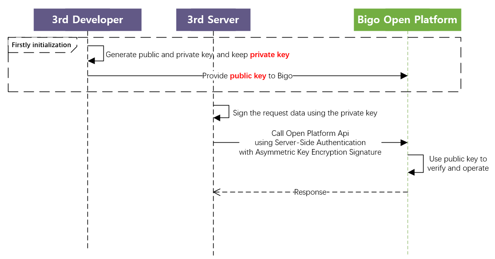

# BIGOLIVE Open Platform Access Guide

# 1. Bigolive Oauth2.0 Authorization Procedure

Bigolive OAuth2.0 Authorization Login currently supports the authorization_code mode and is suitable for server-side application authorization. 


# 2. Authorization Process Integration Steps

## 2.1. Preparatory Steps

### 2.1.1. Domain Address

Interface domain and API should be filled in as {{host_domain}} and replaced according to different environments.

Production environment: [oauth.bigolive.tv](http://oauth.bigolive.tv) , backup domain: [oauth.bigoapp.tv](http://oauth.bigoapp.tv)

### 2.1.2. Business Key Allocation

Bigo will allocate AppID for third-party applications. If necessary, please contact the live broadcast platform liaison urgently to obtain it.

### 2.1.3. Required information from the business side

Please provide relevant information in advance, which includes redirection authorization and display of authorization page information, including:

| **Field** | **Description**                                             |
| --------- | ----------------------------------------------------------- |
| app_name  | Display the third-party app name on the authorization  page |

### 2.1.4. Generate private and public key

The third parties should generate the private and public key, keep the private key safely yourself, and provide the public key and algorithm(RS256 or ES256) to Bigo. 

Detail See [PART 3.1.1.](#311-step-1-generate-private-and-public-key)

You can pre-check the format of public key if is correct through [this website](https://merri.cx/enigmator/cryptanalysis/rsa_key_analysis.html).

### 2.1.5. Error code

It is specially agreed that when the HTTP gateway status code returns 200, normal business data processing is carried out, and the interface returns a JSON body. The specific business error code will be returned in the JSON body. If the status code is not 200, abnormal diagnosis should be carried out based on different status codes.

Gateway Error Codes as follows:

| **Gateway code** | **Description**                                              |
| ---------------- | ------------------------------------------------------------ |
| 200              | Normal, specific business processing can be carried out      |
| 405              | Request method does not exist                                |
| 401              | The token is invalid or has expired, it is used for  interfaces that require access token request |
| 408              | Gateway rate limit                                           |
| 500              | Request parameter exception                                  |


# 3. Server-side Signature Authentication

Signature authentication method is mainly used for identity authentication of interactions between the Bigo platform and third-party service servers. If you only use Server-side signature authentication, you can ignore step 1 to step 3 in "II. Authorization Process Integration Steps".

## 3.1. Digital Signature Algorithm

The digital signature generation method is suitable for business data-sensitive interfaces, such as payment and other APIs. Third parties can ensure the security of signatures by themselves. The public and private keys are generated by the business, and the private key is retained by the business and used to generate signatures, the public key is provided to Bigo and used to verify the signature.

The specific process is as follows:



Bigo only support <font color='#dd00000'>**RS256**</font>(RSA-SHA256) and <font color='#dd00000'>**ES256**</font> (ECDSA-SHA256)

**References:** 

            A.     RS256, PKCS#1 v1.5 (RSA):

https://pycryptodome.readthedocs.io/en/latest/src/signature/pkcs1_v1_5.html

            B.     ES256, DSA and ECDSA:

https://pycryptodome.readthedocs.io/en/latest/src/signature/dsa.html


### 3.1.1. Step 1: Generate private and public key

Firstly and once, the third parties should generate the private and public key, keep the private key safely yourself, and provide the public key and algorithm(RS256 or ES256) to Bigo. Here is a python demo for key generation with RS256, and you can get them in other way. Remind, Only support <font color='#dd00000'>**RS256 and ES256**</font>

See key-generation demo: [key-generation demo](./demo/generate_key.py)


### 3.1.2. Step 2: Sign the request data with private key

Here is rs256 and es256 python signature demos:  ([ES256 demo](./demo/es256_sign_req.py) , [RS256 demo](./demo/rs256_sign_req.py))


### 3.1.3. Step 3: Call Api with Signature

Request parameter description:

The signature is placed in the header of the http request. The specific example format is as follows: 

```python
POST https://{{host_domain}}/broom/xxx_svr_api
Content-type: application/json
bigo-client-id: {client_id}
bigo-timestamp: {timestamp}
bigo-client-version: {version}
bigo-oauth-signature: {sign}
{{postdata}}
```

**Header description：**

| **Header**           | **Description**                                              |
| -------------------- | ------------------------------------------------------------ |
| Content-type         | only support 'application/json‘                              |
| bigo-client-id       | Business unique identifier assigned by Bigolive              |
| bigo-oauth-signature | Authorization signature with Step 2                          |
| bigo-timestamp       | Second level timestamp                                       |
| bigo-client-version  | version of the asymmetric key. Optional, needn't to fill it. Only when you want to update the private and public keys, you can fill it with 1,2,3 or others. |

# 4. Open Platform API

## 4.0. Demo Test API

demo is using Server-side Signature Authentication.

for example, demo is assigned client_id=UP52el4VDWDqgw4 （**developer should replace the id, it dont work in the demo**)

developer should test this api firstly to ensure the generation of bigo-oauth-signature is work.


**Request HTTP Syntax**

```
POST https://{{host_domain}}/oauth2/test_sign HTTP/1.1
Content-type: application/json
bigo-client-id: UP52el4VDWDqgw4
bigo-oauth-signature: {{bigo-oauth-signature}}
bigo-timestamp: {{timestamp}}
bigo-client-version: {{version}}  // optional, default 0

{
  "msg":"hello"
}
```


**Param Assignment:**

host_domain = oauth.bigolive.tv

timestamp= 1688701573

msg_before_sign = "{\n \\"msg\\":\\"hello\\"\n}/oauth2/test_sign1688701573"

msg_hash = sha256(msg_before_sign)

bigo-oauth-signature = base64encode(rsa.sign(msg_hash))


**Response HTTP Syntax**

```python
HTTP/1.1 200

{
    "msg":"hello"
}
```


## 4.2. Currency API

See: the local  doc diamond_api.pdf
