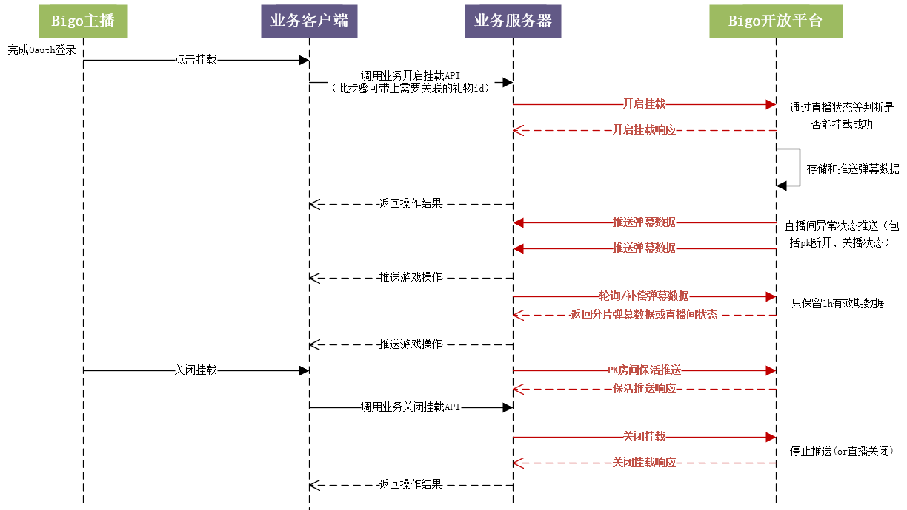

# 一、服务端接口使用说明

下图是单人直播间弹幕数据获取流程交互时序图，蓝色字体均为BigoLive提供给第三方应用的服务端接口：



**统一约定**：

1. 接口域名，API均按{{host_domain}}填写，根据不同环境进行替换

​	测试环境：livelbs-test-pro.bigo.sg:1009 （host绑定到 169.136.104.232）

​	灰度域名：gray-oauth.bigolive.tv

​	正式环境：oauth.bigolive.tv

2. HTTP状态码返回200，进行正常业务数据处理，接口返回body均是json；状态码非200，根据不同状态码进行异常诊断，参见[BIGOLIVE Oauth2.0授权登录说明](./BIGOLIVEOpenPlatformAccessGuide_CN.md#205-错误码说明)网关错误码说明。

3. 所有请求均支持Content-Type: application/x-www-form-urlencoded和Content-Type: application/json，业务按需使用，建议都是用Content-Type: application/json，注意，使用json的postdata不能换行和任何格式化，调用者需去掉换行符。

4. 所有接口返回参数，如果返回参数值是默认值，比如整形是0，字符串是空串""，数组是空数组[]，则会省略此参数，不进行返回

## 1.  开启弹幕游戏

**说明**：此接口功能用于通知直播平台特定直播间一局弹幕游戏开始，直播平台通过此操作开启此直播间弹幕的录制、推送和转发。

**频率控制**：全平台 300/s，单人5/s

**API**：

```
POST https://{{host_domain}}/broom/enable_danmu
Content-type: application/json
Authorization: Bearer {{access_token}}

{{postdata}}
```

**头部说明：**

Authorization：

​	Bearer不要修改，是Bigo固定的一个鉴权方式

​	access_token：授权登录后获取的用户授权token

备注：开启跨房玩法，建议使用房主的accesstoken来鉴权

**请求参数说明：**

| **参数**      | **类型** | **是否必填** | **说明**                                                     |
| ------------- | -------- | ------------ | ------------------------------------------------------------ |
| danmu_type    | int      | 否           | 默认是单人直播间，1跨房pk，其余待扩展                        |
| seqid         | string   | 是           | 请求识别id，建议保证唯一性                                   |
| game_id       | string   | 是           | 识别游戏类型，由bigo平台分配。                               |
| game_sess     | string   | 是           | 游戏会话id，第三方负责生成，需保证唯一。damu_type=0时，单人游戏会话id。damu_type=1时，填充，pk的会话id。 |
| pk_type       | int      | 否           | danmutype=1时填充。0：1v1点对点邀请pk,1：邀请码pk,2：官方pk（可以通过平台推送的信息进行识别）,3：匹配模式(游戏内部的pk) |
| pk_bigo_sess  | string   | 否           | danmutype=1&&pk_type=2时填充                                 |
| game_users    | array    | 是           | pk时需填充双方的openid："game_users":["openidA","openidB"]   |
| timestamp     | int64    | 是           | ms时间戳                                                     |
| game_duration | int      | 是           | 本场游戏时长，单位秒                                         |

**返回参数说明：**

| **参数**  | **类型** | **说明**                                                     |
| --------- | -------- | ------------------------------------------------------------ |
| seqid     | string   | 原封不动返回请求的seqid                                      |
| rescode   | int      | 200：成功300：直播状态存在问题，详见message400：请求参数异常401：达到调用频限500：平台异常，可重试 |
| messge    | string   | 具体错误说明                                                 |
| game_sess | string   | 如请求game_sess为空，平台会创建一个唯一的游戏会话id，调用方需进行关联。建议由游戏生成 |

## 2.  拉取直播间弹幕数据

**说明**：获取直播间弹幕数据，需分批次获取；建议定时检测/补偿弹幕是否有推送缺漏。

**频率控制**：全平台 2000/s，单人10/s

**accesstoken API：**

```
POST https://{{host_domain}}/broom/pull_data
Content-type: application/json
Authorization: Bearer {{access_token}}

{{postdata}}
```

**头部说明：**
Authorization：
	Bearer不要修改，是Bigo固定的一个鉴权方式
	access_token：授权登录后获取的用户授权token

**服务端签名鉴权 API（暂只开放测试环境供测试）：**

```
POST https://{{host_domain}}/sign/broom/pull_data
Content-type: application/json
bigo-oauth-signature: {{sign}}

{{postdata}}

头部说明：
bigo-oauth-signature：签名验证方式sign
```

**请求参数说明：**

| **参数**   | **类型** | **是否必填** | **说明**                                                     |
| ---------- | -------- | ------------ | ------------------------------------------------------------ |
| danmu_type | int      | 否           | 默认0是单人直播间，1是跨房pk，其余待扩展                     |
| seqid      | string   | 是           | 请求识别id，建议保证唯一性                                   |
| game_id    | string   | 是           | 识别游戏类型，由bigo平台分配。                               |
| game_sess  | string   | 是           | 游戏会话id，挂载时游戏生成                                   |
| game_users | array    | 是           | 可同时获取会话内1个或多个直播间的弹幕数据，如在pk的A和B：openid："game_users":["openidA","openidB"] |
| timestamp  | int64    | 是           | ms时间戳，后台会按此时间戳返回此时间之后弹幕数据；如有重叠，会按context进行偏移，尽量保证不重 |
| batch      | int      | 是           | 每个直播间默认100条，最大不超过1000条，第三方可指定          |
| context    | string   | 否           | 上次拉取的上下文序列号，业务需回填到本次拉取请求；填空时会默认从本次弹幕游戏的首条弹幕开始返回 |

**返回参数说明：**

| **参数**   | **类型** | **说明**                                                     |
| ---------- | -------- | ------------------------------------------------------------ |
| seqid      | string   | 原封不动返回请求的seqid                                      |
| rescode    | int      | 200：成功300：直播状态存在问题，详见message400：请求参数异常401：达到调用频限500：平台异常，可重试 |
| messge     | string   | 具体错误说明                                                 |
| danmu_data | array    | 数据数组，参见数据体说明                                     |
| context    | string   | 本次拉取的上下文序列号，下次请求时需带上                     |

**danmu_data数据体说明：**

```
"danmu_data": [
    {
        "openid":"xxxxxxx",//主播openid
        "datas":[
            {
                "type":"heart",//点心数据
                "count":10,//点心数量，有连击的话会聚合计算
                "user":"xxxxxxx",//点心用户的openid
                "nick_name":"xxxxx",//点心用户的昵称
                "user_img":"xxxxx",//点心用户的头像url
                "ts":"1692323232309",//发送 ms时间戳
                "data_seq":"1212091023"//数据的序列号，可通过此字段进行去重
            },
            {
                "type":"msg",//公屏数据
                "content":"xxxxxx",//公屏内容
                "user":"xxxxxxx",//发送公屏用户的openid
                "nick_name":"xxxxx",//发送公屏用户的昵称
                "user_img":"xxxxx",//发送公屏用户的头像url
                "ts":"1692323232309",//发送 ms时间戳
                "data_seq":"1212091023"//数据的序列号，可通过此字段进行去重
            },
            {
                "type":"gift",//礼物消息
                "gift_id":1234,//礼物id
                "gift_url":"https://xxxx",//礼物图标
                "gift_level":1,//礼物档位
                "gift_value":10,//礼物价格
                "gift_count":10,//combo数量
                "gift_name":"aaa", // 礼物名称
                "user":"xxxxxxx",//送礼用户的openid
                "nick_name":"xxxxx",//送礼用户的昵称
                "user_img":"xxxxx",//送礼用户的头像url
                "ts":"1692323232309",//发送 ms时间戳
                "data_seq":"1212091023"//数据的序列号，可通过此字段进行去重
            }
        ]
    },

    //跨房时会返回其他成员的弹幕数据
    {
        "openid":"xxxxxxx",//主播openid
        "data":[
            {
                "type":"heart",//点心数据
                "count":10,//点心数量，有连击的话会聚合计算
                "user":"xxxxxxx",//点心用户的openid
                "nick_name":"xxxxx",//点心用户的昵称
                "user_img":"xxxxx",//点心用户的头像url
                "ts":"1692323232309",//发送 ms时间戳
                "data_seq":"1212091023"//数据的序列号，可通过此字段进行去重
            }
        ]
    }
]
```

## 3. **停止弹幕游戏**

**说明**：此接口功能用于通知直播平台特定直播间停止一局弹幕游戏，直播平台通过此操作关闭直播间弹幕的录制、推送。

**特别说明**：直播平台会自动判断直播间关播，关播后会停止录制、向第三方推送弹幕数据，第三方可以通过接口4获取直播间状态。

**频率控制**：全平台 300/s，单人5/s

**API：**

```
POST https://{{host_domain}}/broom/disable_danmu
Content-type: application/json
Authorization: Bearer {{access_token}}

{{postdata}}
```

**头部说明：**

Authorization：

​	Bearer不要修改，是Bigo固定的一个鉴权方式

​	access_token：授权登录后获取的用户授权token

**请求参数说明：**

| **参数**     | **类型** | **是否必填** | **说明**                                                     |
| ------------ | -------- | ------------ | ------------------------------------------------------------ |
| danmu_type   | int      | 否           | 默认是单人直播间，1弹幕pk，其余待扩展                        |
| seqid        | string   | 是           | 请求识别id，建议保证唯一性                                   |
| game_id      | string   | 是           | 识别游戏类型，由bigo平台分配。                               |
| game_sess    | string   | 是           | 游戏会话                                                     |
| game_users   | array    | 是           | 可同时停止挂载游戏会话内1个或多个直播间，如在pk的A和B：openid："game_users":["openidA","openidB"] |
| pk_type      | int      | 否           | danmutype=1时填充。0：1v1点对点邀请pk1：邀请码pk2：官方pk（可以通过平台推送的信息进行识别）3：匹配模式 |
| pk_bigo_sess | string   | 否           | danmutype=1&&pk_type=2时填充                                 |
| timestamp    | int64    | 是           | ms时间戳                                                     |
| reason       | int      | 是           | 停止原因：            1.     异常退出            2.     主动退出            3.     游戏结束，需附带胜利方 |
| game_result  | json     | 否           | 游戏结果数据，游戏会话停止时填充，具体信息如下               |


```
"game_result":
{
  "win_user": "1",  // 获胜方队伍"1"或"2"，与下面team_type对应，平局使用"0"标识
  "game_score": [
      {
          "openid": "openidA",
          "team_type": "1",
          "total_score": 100,   // 游戏直播间总积分
          "top_user_score": [   // 游戏直播间贡献积分top3用户openid以及积分情况，由大到小排序
            {"openid": "openidC","score":30},
            {"openid": "openidD","score":20},
            {"openid": "openidE","score":10}
          ]
       },
       {
          "openid": "opengidB", // 单人直播间不同阵营，openid一样
          "team_type": "2",
          "total_score": 200,
          "top_user_score": [   // 游戏直播间贡献积分top3用户opengid以及积分情况，由大到小排序
            {"openid": "openidC","score":40},
            {"openid": "openidD","score":20},
            {"openid": "openidE","score":10}
          ]
       }
   ]
}
```


**返回参数说明：**

| **参数** | **类型** | **说明**                                                     |
| -------- | -------- | ------------------------------------------------------------ |
| seqid    | string   | 原封不动返回请求的seqid                                      |
| rescode  | int      | 200：成功300：直播状态存在问题，详见message400：请求参数异常401：达到调用频限500：平台异常，可重试 |
| messge   | string   | 具体错误说明                                                 |

## 4. 获取直播间状态

**说明**：直播间可能因断线、异常退出等问题，会直接关播，游戏方可以通过此接口判断直播间是否已退出直播。可使用sign方式鉴权

**频率控制**：全平台 300/s，单人5/s

**API：**

```
POST https://{{host_domain}}/sign/broom/get_status
Content-type: application/json
bigo-oauth-signature: {{sign}}
bigo-timestamp: {{timestamp}}
bigo-client-id: {{clientid}}


{{postdata}}
```


**头部说明：**

bigo-oauth-signature：签名验证方式sign

**请求参数说明：**

| **参数**   | **类型** | **是否必填** | **说明**                                                     |
| ---------- | -------- | ------------ | ------------------------------------------------------------ |
| seqid      | string   | 是           | 请求识别id，建议保证唯一性                                   |
| timestamp  | int64    | 是           | ms时间戳                                                     |
| game_id    | string   | 是           | 识别游戏类型，由bigo平台分配。                               |
| game_sess  | string   | 是           | 游戏会话id                                                   |
| game_users | array    | 是           | 可同时获取游戏会话内1个或多个直播间的状态，如在pk的A和B：openid："game_users":["openidA","openidB"] |

**返回参数说明：**

| **参数** | **类型** | **说明**                                                     |
| -------- | -------- | ------------------------------------------------------------ |
| seqid    | string   | 原封不动返回请求的seqid                                      |
| rescode  | int      | 200：成功400：请求参数异常401：达到调用频限500：平台异常，可重试 |
| messge   | string   | 具体错误说明                                                 |
| status   | array    | "status":[{"openid":"openidA", "status": 1},{"openid":"opengidB", "status":2}]1：直播间直播状态（无挂载弹幕游戏）2：直播间已开启挂载状态3：直播间已关播 |


## 5.  拉取礼物列表

**说明**：拉取对应主播的礼物列表，有区域特性，不同主播的列表可能不一样，建议在主播开启一场游戏时更新一次。第三方不能缓存太久（建议5-10min，最多不超过一场游戏时长）。如平台接口有问题，可以直接使用上一次的拉取结果。如遇到非指定的giftid弹幕推送，也可以触发重新拉取。

**频率控制**：全平台 1000/s，单人5/s

accesstoken API：

```
POST https://{{host_domain}}/gift/get_list
Content-type: application/json
Authorization: Bearer {{access_token}}

{{postdata}}

头部说明：
Authorization：
	Bearer不要修改，是Bigo固定的一个鉴权方式
	access_token：授权登录后获取的用户授权token
```

服务端签名鉴权 API（暂只开放测试环境供测试）：

```
POST https://{{host_domain}}/sign/gift/get_list
Content-type: application/json
bigo-oauth-signature：签名验证方式sign

{{postdata}}

头部说明：
bigo-oauth-signature：签名验证方式sign
```

**请求参数说明：**

| **参数**  | **类型** | **是否必填** | **说明**                       |
| --------- | -------- | ------------ | ------------------------------ |
| seqid     | string   | 是           | 请求识别id，建议保证唯一性     |
| game_id   | string   | 是           | 识别游戏类型，由bigo平台分配。 |
| timestamp | int64    | 是           | ms时间戳                       |

**返回参数说明：**

| **参数** | **类型**   | **说明**                                                     |
| -------- | ---------- | ------------------------------------------------------------ |
| seqid    | string     | 原封不动返回请求的seqid                                      |
| rescode  | int        | 200：成功400：请求参数异常401：达到调用频限500：平台异常，可重试 |
| messge   | string     | 具体错误说明                                                 |
| list     | json array | 礼物列表，详见下图数据说明，无分页返回                       |

```
"list":[
    {
        "giftid":1234,//礼物id
        "gift_level":1,//礼物档位
        "value":10,//礼物价格
        "icon":"https://static.bigo.tv/xs9sxjsd.webp",//礼物图标icon
        "gift_name":"aaa" // 礼物名称
    },
    {
        "giftid":1235,//礼物id
        "gift_level":2,//礼物档位
        "value":10,//礼物价格
        "icon":"https://static.bigo.tv/xs9sxjsdssd.webp",//礼物图标icon
        "gift_name":"aaa" // 礼物名称
    }
]
```

##  6.  获取弹幕玩法房间列表

**说明**：获取Bigo平台在该弹幕玩法“准备中”的房间集合，可分片拉取；第三方获取后，需过滤出已登录游戏或空闲状态的用户。

**频率控制**：全平台 1000/s，单人20/s

**API：**

```
POST https://{{host_domain}}/broom/get_roomlist
Content-type: application/json
Authorization: Bearer {{access_token}}

{{postdata}}
```

**头部说明：**

Authorization：

​	Bearer不要修改，是Bigo固定的一个鉴权方式

​	access_token：授权登录后获取的用户授权token

**请求参数说明：**

| **参数**  | **类型** | **是否必填** | **说明**                                                     |
| --------- | -------- | ------------ | ------------------------------------------------------------ |
| seqid     | string   | 是           | 请求识别id，建议保证唯一性                                   |
| game_id   | string   | 是           | 识别游戏类型，由bigo平台分配。                               |
| batch     | int      | 否           | 单次最多拉取的个数，默认最多返回500                          |
| timestamp | int64    | 是           | ms时间戳                                                     |
| context   | string   | 否           | 首次拉取不填充（刷新时），批量获取全量时需回带上次拉取返回的context字段 |

**返回参数说明：**

| **参数** | **类型**   | **说明**                                                     |
| -------- | ---------- | ------------------------------------------------------------ |
| seqid    | string     | 原封不动返回请求的seqid                                      |
| rescode  | int        | 200：成功400：请求参数异常401：达到调用频限500：平台异常，可重试 |
| messge   | string     | 具体错误说明                                                 |
| list     | json array | 房间列表，详见下图数据说明                                   |
| context  | string     | 拉取上下文，批量拉取时，下一次拉取需回带到请求的context字段；为空时表示本次拉取已完成，无需进行下次拉取 |


```
"list":[
    {
        "user":"xxxxxxx",//主播的openid
        "nick_name":"xxxxx",//主播的昵称
        "user_img":"xxxxx"//主播的头像url
    },
    {
        "user":"xxxxxxx",//主播的openid
        "nick_name":"xxxxx",//主播的昵称
        "user_img":"xxxxx"//主播的头像url
    }

]
```


## 7.  第三方保活推送

**说明**：第三方定时告知Bigo平台游戏用户的健康状态，但房间状态以平台为准。可使用sign方式鉴权。

**特别说明**：建议保活推送周期为30秒，Bigo平台在2分钟内没收到保活推送，则会重置游戏状态，不再推送弹幕数据

**频率控制**：全平台 1000/s，单人20/s

**API：**

```
POST https://{{host_domain}}/broom/ping
Content-type: application/json
bigo-oauth-signature: {{sign}}
bigo-timestamp: {{timestamp}}
bigo-client-id: {{clientid}}

{{postdata}}
```


**头部说明：**

bigo-oauth-signature：签名验证方式sign

**请求参数说明：**

| **参数**      | **类型** | **是否必填** | **说明**                                                     |
| ------------- | -------- | ------------ | ------------------------------------------------------------ |
| seqid         | string   | 是           | 请求识别id，建议保证唯一性                                   |
| timestamp     | int64    | 是           | ms时间戳                                                     |
| game_users    | array    | 是           | 可同时推送游戏会话内1个或多个直播间的状态，如在pk的A和B：openid："game_users":["openidA","openidB"] |
| game_id       | string   | 是           | 识别游戏类型，由bigo平台分配。                               |
| game_sess     | string   | 是           | 游戏会话id                                                   |
| danmu_type    | int      | 否           | 默认是单人直播间，1跨房pk，其余待扩展                        |
| pk_type       | int      | 否           | danmutype=1时填充。0：1v1点对点邀请pk，1：邀请码pk，2：官方pk（可以通过平台推送的信息进行识别）3：匹配模式 |
| pk_bigo_sess  | string   | 否           | danmutype=1&&pk_type=2时填充                                 |
| game_duration | int      | 是           | 本场游戏时长，单位秒                                         |
| start_time    | int64    | 是           | 本次游戏会话开始的毫秒时间戳                                 |

**返回参数说明：**

| **参数** | **类型** | **说明**                                                     |
| -------- | -------- | ------------------------------------------------------------ |
| seqid    | string   | 原封不动返回请求的seqid                                      |
| rescode  | int      | 200：成功300：直播间状态异常，详见message500：平台异常，可重试 |
| messge   | string   | 具体错误说明                                                 |


## 9.  PK邀约行为通知

**说明**：此接口功能用于通知Bigo平台，主播在PK邀约流程的任意一个操作，行为包括邀请、接受邀请（只有点对点邀请有此行为）、拒绝邀请（只有点对点邀请有此行为）、进房、准备、退房，pk开启（开始游戏）直接调用挂载接口。

**频率控制**：全平台 300/s，单人5/s

**API：**

```
POST https://{{host_domain}}/svr/broom/pk_action
Content-type: application/json
bigo-oauth-signature: {{sign}}
bigo-timestamp: {{timestamp}}
bigo-client-id: {{clientid}}

{{postdata}}
```

头部说明：

bigo-oauth-signature：签名验证方式sign

**请求参数说明**：

| **参数**     | **类型** | **是否必填** | **说明**                                                     |
| ------------ | -------- | ------------ | ------------------------------------------------------------ |
| game_id      | string   | 是           | 识别游戏类型，由bigo平台分配。                               |
| seqid        | string   | 是           | 请求识别id，建议保证唯一性                                   |
| openid       | string   | 是           | 触发行为的用户openid                                         |
| pk_type      | int      | 是           | 0：1v1点对点邀请pk1：邀请码pk2：官方pk（可以通过平台推送的信息进行识别） |
| pk_sess      | string   | 否           | pk_type=0或1，填充游戏侧创建的游戏会话id。pk_type=2，填充平台推送给游戏的pk_bigo_sess，参考3.2 |
| timestamp    | int64    | 是           | ms时间戳                                                     |
| action       | int      | 是           | 1：1v1点对点邀请，2：接受邀请（只有点对点邀请有此行为），3：拒绝邀请（只有点对点邀请有此行为），4：进房，5：准备，6：退房，7：超时结束，8：接受但已满员，9：取消准备 |
| peer_user    | array    | 否           | pk对方的openid，暂定只需要在action=1,2,3时填充               |
| timeout_user | array    | 否           | action=7时，填充没进入游戏的用户                             |

**返回参数说明**：

| **参数** | **类型** | **说明**                                                     |
| -------- | -------- | ------------------------------------------------------------ |
| seqid    | string   | 原封不动返回请求的seqid                                      |
| rescode  | int      | 200：成功300：直播状态存在问题，详见message400：请求参数异常401：达到调用频限500：平台异常，可重试 |
| messge   | string   | 具体错误说明                                                 |


##  10.  用户行为通知

**说明**：此接口功能用于通知Bigo平台，主播相关行为的通知，目前需要的是用户登录App通知

**频率控制**：全平台 300/s，单人5/s

**API：**

```
POST https://{{host_domain}}/broom/user_action
Content-type: application/json
Authorization: Bearer {{access_token}}

{{postdata}}
```


头部说明：

Authorization：

Bearer不要修改，是Bigo固定的一个鉴权方式

access_token：授权登录后获取的用户授权token

备注：开启跨房玩法，建议使用房主的accesstoken来鉴权

**请求参数说明：**

| **参数**  | **类型** | **是否必填** | **说明**                                  |
| --------- | -------- | ------------ | ----------------------------------------- |
| game_id   | string   | 是           | 识别游戏类型，由bigo平台分配。            |
| seqid     | string   | 是           | 请求识别id，建议保证唯一性                |
| timestamp | int64    | 是           | ms时间戳                                  |
| action    | int      | 是           | 1：用户成功登录APP，web云游戏可忽略此动作 |

**返回参数说明：**

| **参数** | **类型** | **说明**                                                     |
| -------- | -------- | ------------------------------------------------------------ |
| seqid    | string   | 原封不动返回请求的seqid                                      |
| rescode  | int      | 200：成功300：直播状态存在问题，详见message400：请求参数异常401：达到调用频限500：平台异常，可重试 |
| messge   | string   | 具体错误说明                                                 |


## 11.  游戏推流地址获取

**备注**：不产生游戏流的第三方，可以忽略此接口。

**说明**：用于第三方平台推送游戏媒体流数据给bigo平台，只接受rtmp流

**频率控制**：全平台 300/s，单人5/s

**API：**

```
POST https://{{host_domain}}/media/get_rtmp_url
Content-type: application/json
Authorization: Bearer {{access_token}}

{{postdata}}
```

头部说明：

Authorization：

​	Bearer不要修改，是Bigo固定的一个鉴权方式

​	access_token：授权登录后获取的用户授权token

**请求参数说明：**

| **参数**  | **类型** | **是否必填** | **说明**                       |
| --------- | -------- | ------------ | ------------------------------ |
| game_id   | string   | 是           | 识别游戏类型，由bigo平台分配。 |
| seqid     | string   | 是           | 请求识别id，建议保证唯一性     |
| timestamp | int64    | 是           | ms时间戳                       |

**返回参数说明：**

| **参数** | **类型** | **说明**                                                     |
| -------- | -------- | ------------------------------------------------------------ |
| seqid    | string   | 原封不动返回请求的seqid                                      |
| rescode  | int      | 200：成功，可进行推流 201：主播还没ready，第三方需要轮询直到返回200 202：主播已关播或主播直播间无需接收游戏流，第三方可以取消推流 500：服务端异常，需重试 |
| messge   | string   | 具体错误说明                                                 |
| rtmp_url | string   | bigo提供的服务流地址。第三方可拼接上下文信息进行消息传递（不能使用平台预留的字段），token需第三方拼接填写用户的access_token **备注：**如第三方需要感知推流异常，需要填充回调地址，encode_uri(url)加到rtmp_url后面进行推流。例如：rtmp_url返回是rtmp://publish.bigo.tv/gameplay/{openid}/{md5}?game_id=xxx&token=xxxxxxxx填充回调地址后：rtmp://publish.bigo.tv/gameplay/{openid}/{md5}?game_id=xxx&token=xxxxxxxx&redirect_url=xxxxx |


第三方推流后，bigo可能会因平台问题会中断推流，具体会通过redirect_url回调给第三方说明原因。如因第三方自行中断（中断时，bigo会回调102状态码），或者没有相关回调，第三方需要重推。

**回调参数说明：**

| **参数**  | **类型** | **说明**                               |
| --------- | -------- | -------------------------------------- |
| rtmpUrl   | string   | 推流链接，第三方可以用于识别哪路流异常 |
| status    | int      | 状态码，参考推流状态码表格             |
| timestamp | long     | ms时间戳                               |
| errorDesc | Array    | status 106时才会填充                   |
|           |          |                                        |

**status推流状态码：**

| **status** | **说明**                                         |
| ---------- | -----------------------------------              |
| 100        | 鉴权成功并从客户端第一次收到数据                 |
| 101        | 正在推流。每路流每30s同步一次状态。              |
| 102        | 推流链接已经断开。                               |
| 104        | 因玩法关闭后没停止推流，服务器主动与客户端断开   |
| 106        | 因非法推流参数，服务器主动断开。                 |
| 其他       | 其他错误，第三方可以直接中断推送。               |
|            |                                                  |

errorDesc 是一个数组，每一个元素的结构：

| **字段名**  | **类型** | **注释**                                                     |
| ----------- | -------- | ------------------------------------------------------------ |
| reason      | int      | status106时填充，参考以下枚举值enum StreamStopReason{  UNSUPPORT_AUDIO_FORMAT = 1, //不支持的音频编码  UNSUPPORT_VIDEO_FORMAT = 2, //不支持的视频编码}; |
| recommended | string   | status106时填充，错误参数对应的正确推荐值：{  "AAC",  "H264" }; |

第三方收到回调处理后，返回如下信息
| **参数** | **类型** | **说明**                                                     |
| -------- | -------- | ------------------------------------------------------------ |
| code   | int      | 0：成功, 其他为失败                                            |
| messge | string   | 具体错误说明                                                   |


## 12.  观众行为通知

**说明**：此接口功能用于通知Bigo平台，观众相关行为的通知。目前只在danmu_type=0（单人直播间）时需要调用，第三方拉取到弹幕数据，明确用户加入阵营后触发通知。
**备注**：必须触发阵营通知后，Bigo客户端才能显示置顶礼物栏

**频率控制**：全平台 1000/s，单人5/s

**API：**

```
POST https://{{host_domain}}/sign/broom/audience_action
Content-type: application/json
bigo-oauth-signature: {{sign}}
bigo-timestamp: {{timestamp}}
bigo-client-id: {{clientid}}

{{postdata}}
```


头部说明：

bigo-oauth-signature：签名验证方式sign

**请求参数说明：**

| **参数**  | **类型** | **是否必填** | **说明**                                                     |
| --------- | -------- | ------------ | ------------------------------------------------------------ |
| seqid     | string   | 是           | 请求识别id，建议保证唯一性                                   |
| timestamp | int64    | 是           | ms时间戳                                                     |
| openid    | string   | 是           | 用户openid                                                   |
| game_id   | string   | 是           | 识别游戏类型，由bigo平台分配。                               |
| game_sess | string   | 是           | 游戏会话id                                                   |
| action    | int      | 是           | 1：用户加入阵营                                              |
| info      | json     | 否           | 其他信息，action=1时，携带加入的具体阵营1:red；2:blue，如 "team_type":"1"或"team_type":"2", 具体信息如下 |


```
"info":
{
  "team_type": "1",  // 加入的具体阵营"1"或"2"; 当action=1时需要携带
}
```

**返回参数说明：**

| **参数** | **类型** | **说明**                                                     |
| -------- | -------- | ------------------------------------------------------------ |
| seqid    | string   | 原封不动返回请求的seqid                                      |
| rescode  | int      | 200：成功300：直播状态存在问题，详见message400：请求参数异常401：达到调用频限500：平台异常，可重试 |
| messge   | string   | 具体错误说明                                                 |

## 13.  推送弹幕游戏结果积分信息

**说明**：此接口功能用于在一局游戏结束后，通知直播平台此局游戏的结果积分详细信息，包括总积分以及有贡献用户的积分情况。

**频率控制**：全平台 1000/s，单人5/s

**API：**

```
POST https://{{host_domain}}/sign/broom/game_result
Content-type: application/json
bigo-oauth-signature: {{sign}}
bigo-timestamp: {{timestamp}}
bigo-client-id: {{clientid}}

{{postdata}}
```

头部说明：

bigo-oauth-signature：签名验证方式sign

**请求参数说明：**

| **参数**     | **类型** | **是否必填** | **说明**                                                     |
| ------------ | -------- | ------------ | ------------------------------------------------------------ |
| danmu_type   | int      | 否           | 默认是单人直播间，1弹幕pk，其余待扩展                        |
| seqid        | string   | 是           | 请求识别id，建议保证唯一性                                   |
| game_id      | string   | 是           | 识别游戏类型，由bigo平台分配。                               |
| game_sess    | string   | 是           | 游戏会话                                                     |
| pk_type      | int      | 是           | danmutype=1时填充。0：1v1点对点邀请pk，1：邀请码pk，2：官方pk（可以通过平台推送的信息进行识别）3：匹配模式 |
| pk_bigo_sess | string   | 否           | danmutype=1&&pk_type=2时填充                                 |
| timestamp    | int64    | 是           | ms时间戳                                                     |
| game_result  | json     | 是           | 游戏结果数据，游戏会话停止时填充，具体信息如下               |


```
"game_result":
{
  "win_user": "1",  // 获胜方队伍"1"或"2"，与下面team_type对应，平局使用"0"标识
  "game_score": [
      {
          "openid": "openidA",
          "team_type": "1",
          "total_score": 100,   // 游戏直播间总积分
          "top_user_score": [       // 游戏直播间有贡献积分用户的opengid以及积分情况，如超过100个，则分多次推送
            {"openid": "openidC","score":30},
            {"openid": "openidD","score":20},
            {"openid": "openidE","score":10}
          ]
       },
       {
          "openid": "opengidB",     // 单人直播间不同阵营，openid一样
          "team_type": "2",
          "total_score": 200,
          "top_user_score": [       // 游戏直播间有贡献积分用户的opengid以及积分情况，如超过100个，则分多次推送
            {"openid": "openidC","score":40},
            {"openid": "openidD","score":20},
            {"openid": "openidE","score":10}
          ]
       }
   ]
}
```

**返回参数说明：**

| **参数** | **类型** | **说明**                                                     |
| -------- | -------- | ------------------------------------------------------------ |
| seqid    | string   | 原封不动返回请求的seqid                                      |
| rescode  | int      | 200：成功300：直播状态存在问题，详见message400：请求参数异常401：达到调用频限500：平台异常，可重试 |
| messge   | string   | 具体错误说明                                                 |

## 14. 推送直播间弹幕测试数据

**说明**：推送主播直播间弹幕测试数据，此接口仅测试阶段使用(主要用于测试礼物数据)，需bigo侧配置主播白名单。

**频率控制**：全平台 100/s，单人5/s

**accesstoken API：**

```
POST https://{{host_domain}}/broom/push_test_data
Content-type: application/json
Authorization: Bearer {{access_token}}

{{postdata}}
```

**头部说明：**
Authorization：
	Bearer不要修改，是Bigo固定的一个鉴权方式
	access_token：授权登录后获取的用户授权token

**请求参数说明：**

| **参数**   | **类型** | **是否必填** | **说明**                                                     |
| ---------- | -------- | ------------ | ------------------------------------------------------------ |
| seqid      | string   | 是           | 请求识别id，建议保证唯一性                                   |
| game_id    | string   | 是           | 识别游戏类型，由bigo平台分配。                               |
| game_sess  | string   | 否           | 游戏会话id，挂载时游戏生成，不设置，将尝试自动使用主播当前所开启游戏会话id |
| datas      | array    | 是           | 数据数组，详见如下数据说明，与2.拉取直播间弹幕数据datas一致  |

```
"datas":[
    {
        "type":"gift",//礼物消息
        "gift_id":1234,//礼物id
        "gift_url":"https://xxxx",//礼物图标
        "gift_level":1,//礼物档位
        "gift_value":10,//礼物价格
        "gift_count":10,//combo数量
        "gift_name":"aaa", // 礼物名称
        "user":"xxxxxxx",//送礼用户的openid，需要真实用户openid
        "nick_name":"xxxxx",//送礼用户的昵称
        "user_img":"xxxxx",//送礼用户的头像url
        "ts":"1692323232309",//发送 ms时间戳(字符串数字)
        "data_seq":"1212091023"//数据的序列号(字符串数字)，同一局游戏中不能重复，通过此字段进行去重
    },
    {
        "type":"gift",//礼物消息
        "gift_id":1234,//礼物id
        "gift_url":"https://xxxx",//礼物图标
        "gift_level":1,//礼物档位
        "gift_value":10,//礼物价格
        "gift_count":10,//combo数量
        "gift_name":"aaa", // 礼物名称
        "user":"xxxxxxx",//送礼用户的openid，需要真实用户openid
        "nick_name":"xxxxx",//送礼用户的昵称
        "user_img":"xxxxx",//送礼用户的头像url
        "ts":"1692323232310",//发送 ms时间戳(字符串数字)
        "data_seq":"1212091024"//数据的序列号(字符串数字)，同一局游戏中不能重复，通过此字段进行去重
    }
]
```

**返回参数说明：**

| **参数**   | **类型** | **说明**                                                     |
| ---------- | -------- | ------------------------------------------------------------ |
| seqid      | string   | 原封不动返回请求的seqid                                      |
| rescode    | int      | 200：成功 300: 主播或游戏状态未开启 400: 请求参数异常 500：平台异常，可重试 |
| messge     | string   | 具体错误说明                                                 |


# 二、推送给第三方接口说明

[弹幕数据推送给第三方接口说明](./danmu_data_push_cn.md)


# 三、APP跳转游戏参数说明

根据第三方提供的deeplink/onelink/web_url，会根据平台玩法提供以下几个参数，供玩法逻辑判断：

| **参数**   | **选项** | **说明**                                                     |
| ---------- | -------- | ------------------------------------------------------------ |
| openId     | required | 主播的openid                                                 |
| code       | required | 授权码，如用户之前没获取到refreshtoken，可以使用code进行获取，每次跳转都会带上 |
| gameId     | required | 识别游戏类型，由bigo平台分配                                 |
|            |          | 平台创建的pk会话，全局唯一                                   |
| gameType   | optional | 单人/多人游戏                                                |
| inviteCode | optional | 房间码，用于邀约分享时快速进入游戏房                         |
| lang       | optional | 主播语言码                                                   |

第三方先判断openid的之前的refreshtoken/accesstoken是否过期，如果过期了，可使用code来获取token。

# 四、游戏端相关素材物料问题

1.游戏内的美术素材由游戏方准备，准备好打包发给BIGO产品

2.Bigo基于游戏提供的素材，输出游戏启动页（BIGO平台的入口使用）、礼物ICON及动画等BIGO生态的设计内容

3.游戏需支持多语言，多语言如下：中文、英文、土耳其、西班牙语、韩语、越南语、阿拉伯语、印尼语、马来语、法语、葡语、俄语、泰语、繁体中文、德语、意大利语、缅甸语、柬埔寨语、瑞典、荷兰、波兰、罗马尼亚、乌尔都语、日语
