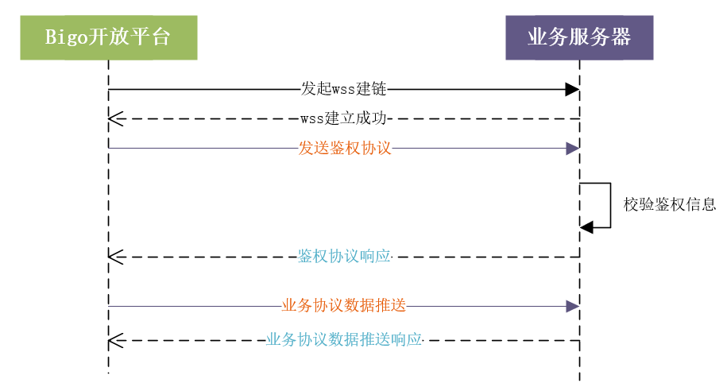

# 弹幕数据推送给第三方接口说明

## 一、推送数据流程说明

需第三方提供接口，平台推送请求或获取第三方平台相关接口。

平台不保证点赞、评论、送礼等这些消息按照用户操作的顺序推送给第三方，比如有可能第三方会先收到送礼的消息；需要第三方自行处理好消息乱序的情况。

平台建议业务通过推+拉结合的方式进行弹幕数据获取。因网络波动或其他异常，推送数据存在消息丢失的概率，第三方可通过拉取数据进行轮询补偿拉取。拉取API参考[danmu_data_api_cn.md#2. 拉取直播间弹幕数据](https://github.com/yothen/Bigo-Open-Api/blob/main/danmu_data_api_cn.md#2--%E6%8B%89%E5%8F%96%E7%9B%B4%E6%92%AD%E9%97%B4%E5%BC%B9%E5%B9%95%E6%95%B0%E6%8D%AE)

本文档推送数据流程如下：

​            1.     第三方提供接入信息（参考：本文档第二点）

​            2.     BIGO服务初始化会和第三方建立wss连接

​            3.     建立wss连接后，发送鉴权协议，第三方校验鉴权信息。返回校验结果

​            4.     业务消息复用已鉴权的链接推送消息，每条消息包含签名，用于校验消息完整性

​            a.     若该连接未鉴权需要拒绝丢弃

​            b.     若该连接已鉴权做业务处理



## 二、接入方需要提供信息

| 字段                  | 说明                                                         |
| --------------------- | ------------------------------------------------------------ |
| wss的链接地址         | 用于BIGO连接后，通过wss连接推送平台数据测试、灰度、线上地址  |
| 第三方平台缩写        | 用于鉴权协议的签名生成                                       |
| wss连接的静态账号密码 | account 账号password 密码用于wss鉴权协议认证，私发提供（不要在群聊发送） |


## 三、协议结构

基于websocket传输，消息内容使用Json传输。通用协议格式定义

请求：

| 参数      | 类型    | 描述                              |
| --------- | ------- | --------------------------------- |
| **uri**   | String  | 请求地址                          |
| retry_cnt | Integer | 重试次数                          |
| send_time | Long    | 消息发送的毫秒时间戳              |
| **data**  | Object  | 消息对象内容，不同的uri，内容不同 |

响应：

| 参数      | 类型    | 描述                                                      |                                                              |
| --------- | ------- | --------------------------------------------------------- | ------------------------------------------------------------ |
| **uri**   | String  | 请求地址。具体填充内容参考以下协议说明                    |                                                              |
| send_time | Long    | 请求体中的send_time                                       |                                                              |
| resp_time | Long    | 回包时的毫秒时间戳                                        |                                                              |
| up_cost   | Long    | 收到请求时当前时间戳-send_time 就是上行的网络耗时         | 平台接受回包后用当前时间戳-resp_time= 下行的网络耗时用于监控请求耗时 |
| **data**  | Object  | 响应消息对象内容，不同的uri对应不同数据，参考以下协议说明 |                                                              |
| retry_cnt | Integer | 请求参数中重试次数                                        |                                                              |

##

## 3.1. 鉴权协议

**1.请求参数说明**

**uri**：填充platformLogin

**data：**

| 字段      | 类型   | 描述                                                         |
| --------- | ------ | ------------------------------------------------------------ |
| account   | String | 账号密码，第三方分配                                         |
| timestamp | String | 毫秒时间戳,string                                            |
| sign      | String | sign区分大小写例: timestamp="1693796233988", password="213213"sign = md5(password:213213&tamp:1693796233988&(第三方平台缩写)&account:bigoUser1)"sign": md5("password:" + password + "&tamp:" + timestamp + "&inke&account:" + account) |

例子：

```
{
	"uri": "platformLogin",
	"retry_cnt": 0,
	"send_time": 1713249091251,
	"data": "{\"account\":\"bigoUser1\",\"timestamp\":\"1713249091251\",\"sign\":md5(\"password:\"+password+\"&tamp:\"+timestamp+\"&inke&account:\"+account)}"
}
```


**2.返回参数说明**

**uri**：填充platformLoginResp

**data**：

| 字段    | 类型    | 描述                                  |
| ------- | ------- | ------------------------------------- |
| code    | Integer | 200成功400失败,账号不存在或者sign不对 |
| message | String  | 失败原因                              |

例子：

```
{
	"uri": "platformLoginResp",
   "retry_cnt": 0,
	"send_time": 1712826230972,
	"resp_time": 1712826231009,
	"up_cost": 37,
	"data": "{\"code\":400,\"access_token\":\"xxxxxxx\",\"message\":\"sign is error.\"}"
}
```


## 3.2. 心跳监听

建立连接后，心跳5s/次。30秒超时断开。

使用wss原生的ping

##

以上2个协议是建立建链和保活使用的系统协议，以下是具体对应的推送业务协议。


## 3.3. 弹幕推送数据协议

以下通信协议请求参数都需要带上鉴权协议返回的access_token，游戏平台需要校验access_token的合法性。

**1.请求参数说明**

**uri**：填充dataReception

**data**：

| **参数**   | **类型**   | **说明**                                                     |
| ---------- | ---------- | ------------------------------------------------------------ |
| seqid      | string     | Bigo平台生成的seqid，用于跟踪请求                            |
| timestamp  | int64      | ms时间戳                                                     |
| danmu_data | json array | 数据数组，详见二.3拉取直播间弹幕数据                         |
| game_id    | string     | 识别游戏类型，由bigo平台分配。                               |
| game_sess  | string     | 游戏会话id                                                   |
| status     | int        | 直播间状态1：直播间直播状态（无挂载弹幕游戏）2：直播间开启挂载后的状态3：直播间关播时触发，只会推送一次，触发后本次弹幕直播不会再推送数据 |

例子

```
{
	"data":"{\"game_sess\":\"1712876190998\",\"danmu_data\":[{\"openid\":\"AREsz4MyPGdw5an9bozBP28V7AGjGC0GvoZQBG\",\"datas\":[]}],\"seqid\":\"1712866435\",\"game_id\":\"10000\",\"status\":3,\"timestamp\":1712866435586}",
	"access_token": "42fababa5a4d8059e3efea37b98c9e37",
   "sign":"xxxxxx",
	"retry_cnt": 0,
	"send_time": 1712866435852,
	"uri": "dataReception"
}
```


**2.返回参数说明**

**uri**：填充dataReceptionResp

**data**：

| **参数** | **类型** | **说明**                               |
| -------- | -------- | -------------------------------------- |
| seqid    | string   | Bigo平台生成的seqid，用于跟踪请求      |
| rescode  | int      | 200，第三方接受成功其他，异常见message |
| message  | string   | 错误具体信息                           |

响应例子

```python
{
	"uri": "dataReceptionResp",
   "retry_cnt": 0,
	"send_time": 1712826230972,
	"resp_time": 1712826231009,
	"up_cost": 37,
	"data": "{\"seqid\":\"464467303_1712826230722_3584152_553933579\",\"rescode\":200,\"message\":\"\"}"
}
```
